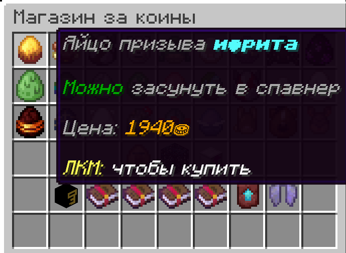

# ShopGUI

ShopGUI — плагин для Minecraft 1.21.8 (Paper), который добавляет GUI магазин с покупкой предметов и выполнением команд за уникальную валюту через CoinsEngine.

---

## Возможности

- Настраиваемый GUI магазин с предметами
- Интеграция с CoinsEngine для работы с валютами
- Поддержка зачарованных предметов и кастомных голов
- Гибкая настройка валюты через конфиг
- Выполнение команд от имени консоли
- Современный код для Paper 1.21.8 с поддержкой Adventure API
- Возможность продавать предметы или выполнять команды



---

## Конфигурация (config.yml)

```yaml
# Настройки магазина

# Используемая валюта из CoinsEngine
currency: "coins"

# Название GUI магазина (поддерживает цвета и форматирование)
gui-title: "&6Магазин за коины"

# Если не задана command, то игроку при покупке выдаётся предмет, иначе - выполняется команда
shop-items:
  empty_spawner:
    name: "§6Пустой спавнер"
    material: SPAWNER
    slot: 10
    price: 2000
    lore:
      - "§7Пустой спавнер для мобов"
      - "§7Цена: §6%price% coins"
      - ""
      - "§eМожно настроить с помощью яиц призыва"

  zombie_egg:
    name: "§2Яйцо призыва зомби"
    material: ZOMBIE_SPAWN_EGG
    slot: 19
    price: 500
    lore:
      - "§7Используйте на спавнере для настройки"
      - "§7Цена: §6%price% coins"

  skeleton_egg:
    name: "§fЯйцо призыва скелета"
    material: SKELETON_SPAWN_EGG
    slot: 20
    price: 600
    lore:
      - "§7Используйте на спавнере для настройки"
      - "§7Цена: §6%price% coins"

  elytra_unbreaking3_mending1:
    name: "§5Элитры"
    material: ELYTRA
    slot: 43
    price: 1000
    lore:
      - ""
      - "§7Цена: §6%price%⛂"
      - ""
      - "§eЛКМ: §fчтобы купить"
    enchantments:
      unbreaking: 3
      mending: 1

  cosmetic_key:
    name: "§dКлюч от кейса с косметикой"
    material: PLAYER_HEAD
    texture: "eyJ0ZXh0dXJlcyI6eyJTS0lOIjp7InVybCI6Imh0dHA6Ly90ZXh0dXJlcy5taW5lY3JhZnQubmV0L3RleHR1cmUvOTdhOTc3MmY3ODMxMmIxNDE1NmE0ZThiNjZhNTQ4YjE3MjViYTY5MWI4YjdhMDY2OGFmNjE2MWMyYjgzOGU5YiJ9fX0="
    slot: 37
    price: 150
    lore:
      - "§7Получите ключ для открытия кейса"
      - "§7с косметикой /uc"
      - ""
      - "§7Цена: §6%price%⛂"
      - ""
      - "§eЛКМ: §fчтобы купить"
    command: "uc give key 1 %player%"  # Будет использована команда вместо выдачи игроку головы
```

### Поддерживаемые параметры для предметов:

- `name` — название предмета (поддерживает цвета и форматирование)
- `material` — тип материала (например, `SPAWNER`, `ELYTRA`, `PLAYER_HEAD`)
- `slot` — слот в GUI (0-53)
- `price` — цена в указанной валюте
- `lore` — описание предмета (автоматически заменяется `%price%` на цену)
- `command` — команда для выполнения при покупке (вместо выдачи предмета)
- `texture` — текстура для головы (Base64)
- `enchantments` — зачарования для предмета

### Переменные в командах:
- `%player%` — автоматически заменяется на имя игрока

---

## Использование магазина

1. **Открытие магазина**: `/dshop`
2. **Покупка предмета**: ЛКМ по предмету в GUI
3. **Автоматическое списание**: Валюта автоматически списывается с баланса игрока
4. **Выполнение команды**: После покупки игроку выдаётся купленный предмет или выполняется указанная команда от имени консоли

**Процесс покупки:**
- Проверка достаточности средств
- Автоматическое списание валюты
- Выполнение команды или создание предмета
- Информативное сообщение о покупке

---

## Команды и права

- `/dshop` — открыть магазин (permission: `dshop.use`)
- `/dshop reload` — перезагрузить конфиг (permission: `dshop.reload`)

**Разрешения:**
- `dshop.use` — доступ к магазину
- `dshop.reload` — перезагрузка конфига

---

## Настройка валюты

Плагин использует валюту из CoinsEngine, указанную в конфиге:

```yaml
currency: "coins"
```

**Поддерживаемые форматы валют:**
- `coins` — основная валюта
- `gems` — драгоценные камни
- `tokens` — жетоны
- Любая другая валюта, созданная в CoinsEngine

**Для создания новой валюты используйте команды CoinsEngine:**
```
/coinsengine currency create mycurrency ⛁
/coinsengine currency setname mycurrency "Моя валюта"
```

---

## Требования

- **Minecraft Paper 1.21.8**
- **Java 21**
- **Обязательно**: [CoinsEngine](https://github.com/nulli0n/CoinsEngine-spigot) (для экономики)

---

## Установка

1. Убедитесь, что установлен **CoinsEngine**
2. Скачайте последнюю версию ShopGUI
3. Поместите файл в папку `/plugins`
4. Перезапустите сервер
5. Настройте `config.yml` под свои нужды
6. Используйте `/dshop reload` для применения изменений

---
